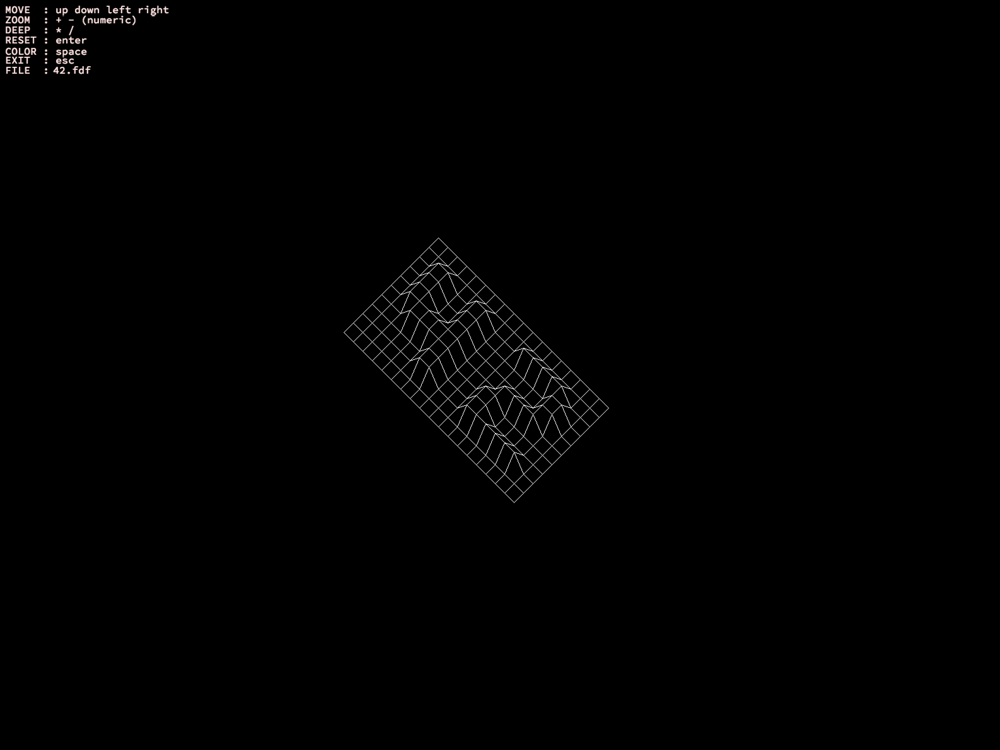
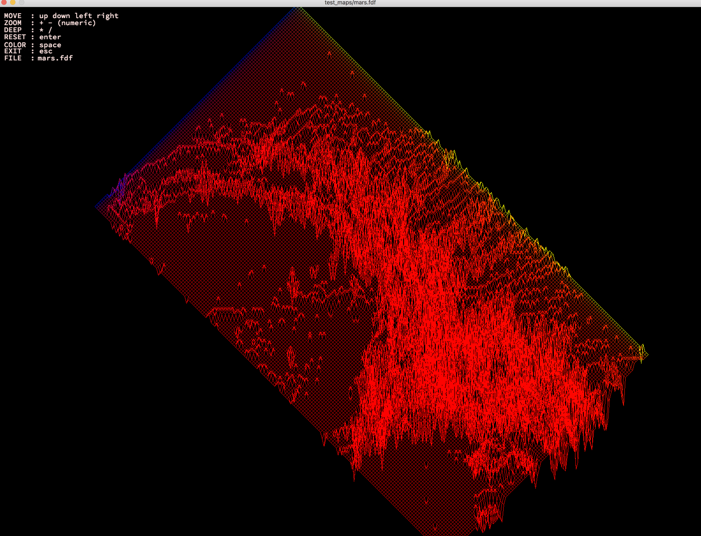

# FdF
> Creating a simplified 3D graphic representation

This project is about creating a simplified graphic “wireframe” (“fils de fer” in french, hence the name of the project) representation of a relief landscape linking various points (x, y, z) via segments.




## Installation

OS X & Linux:

```sh
make && make clean
```

## Usage example

```sh
./fdf test_maps/[map]
```

## Meta

Adilyam Tilegenova – [linkedin](https://www.linkedin.com/in/adilyam-tilegenova-5b3180148/) – adilyamt@gmail.com

[https://github.com/Adilyam](https://github.com/Adilyam)


